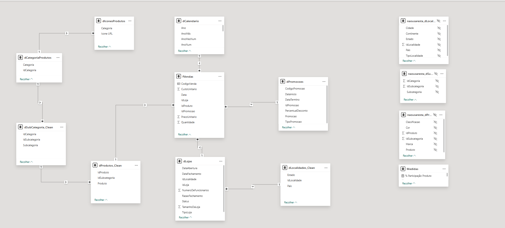

# 🧠 Modelagem de Dados

Esta etapa do projeto foi dedicada à estruturação dos dados para garantir consistência, desempenho e confiabilidade nas análises.

---

## 📐 Abordagem

Foi utilizada **modelagem dimensional (Star Schema)**, separando claramente tabela fato e dimensões.

Essa abordagem facilita a análise dos dados, melhora a performance do modelo e garante correta propagação de filtros.

---

## 📊 Estrutura do Modelo

### Tabela Fato

- **f_vendas**  
Responsável por armazenar as métricas de negócio, como vendas, custos, descontos e quantidade.

---

### Tabelas Dimensão

- **d_calendario** → estrutura temporal para análises ao longo do tempo  
- **d_Produtos** → categorização dos produtos  
- **d_Promocoes** → tipos de promoções aplicadas  
- **d_Lojas** → informações das lojas  
  
---

## 🔗 Relacionamentos

- Estrutura baseada em **1:N (um para muitos)**  
- Direção de filtro **unidirecional (dimensão → fato)**  

Essa configuração garante maior controle e evita ambiguidades no modelo.

---

## 🧹 Tratamento de Dados

Devido à ausência de acesso direto ao banco de dados, os dados foram tratados previamente no Excel antes da importação para o Power BI. Foram realizadas unificações de tabelas dimensionais, consolidando informações de Produto e Loja em uma única estrutura.

---

## 🚀 Benefícios do Modelo

- Melhor performance nas consultas  
- Facilidade de manutenção  
- Escalabilidade  
- Confiabilidade nas análises  

---

## 📊 Representação do Modelo

