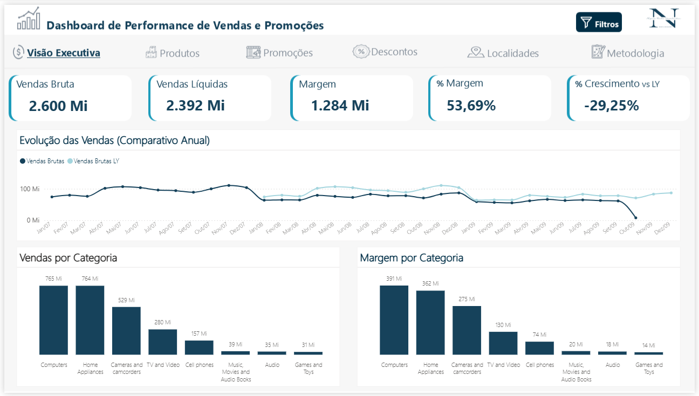
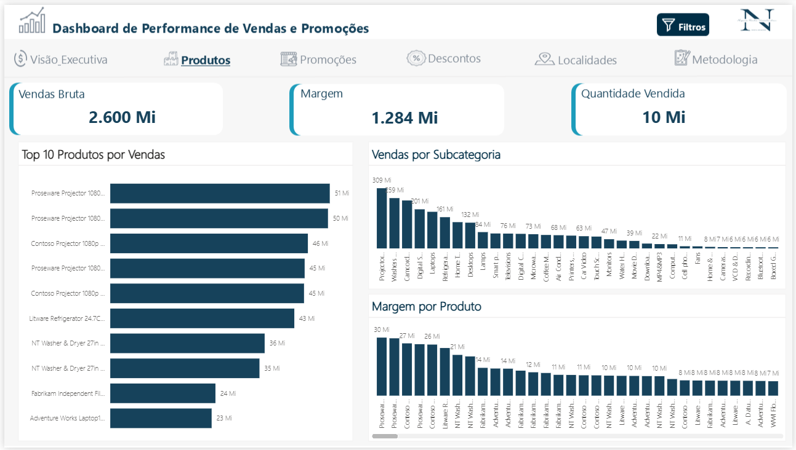
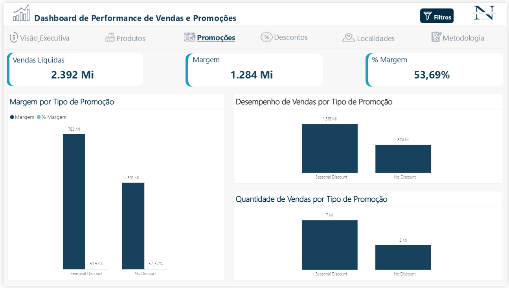
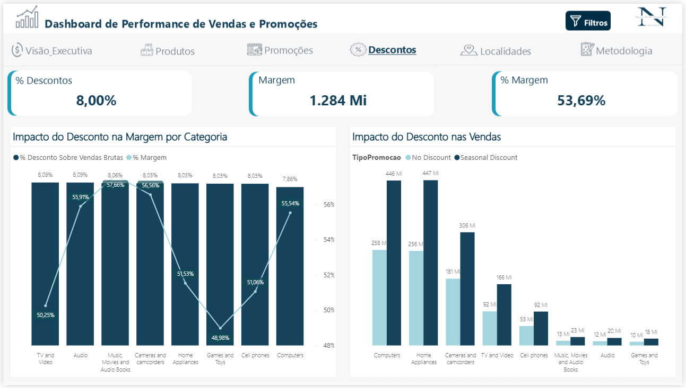
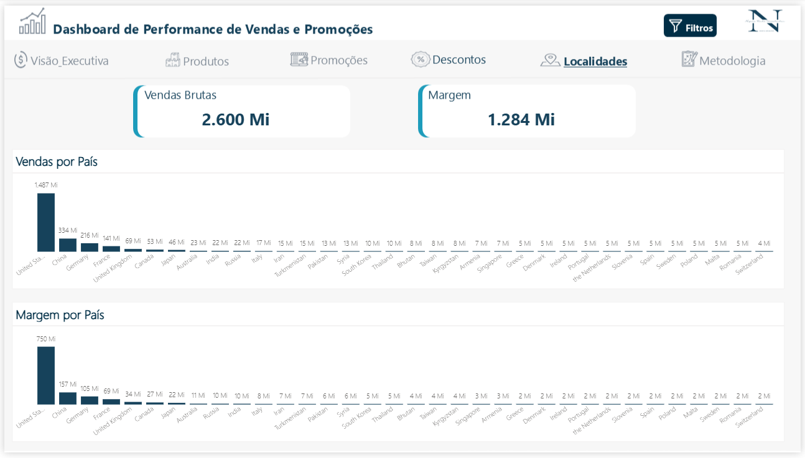
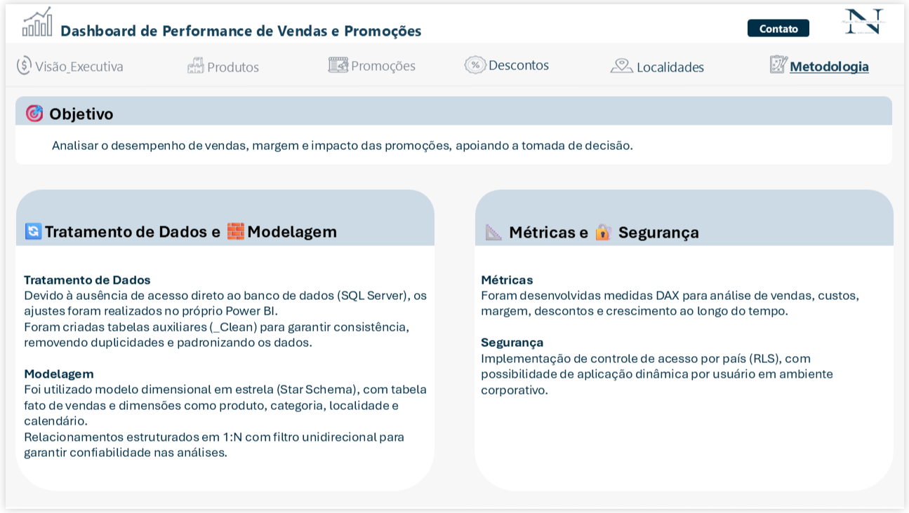

# 📊 Sales & Promotions Performance Dashboard — Power BI

Projeto de **Business Intelligence** desenvolvido em Power BI com o objetivo de analisar o desempenho de vendas, margem e impacto de promoções em uma empresa fictícia de varejo, utilizando **dados simulados para fins de análise**.

O dashboard foi desenvolvido como parte de um **case técnico em processo seletivo**, sendo bem avaliado e contribuindo para minha classificação para a próxima etapa.

---

# 🎯 Problema de Negócio

Empresas que utilizam promoções frequentemente enfrentam desafios como:

- Quais promoções realmente aumentam as vendas?
- Os descontos estão impactando positivamente a receita?
- Quais produtos geram mais resultado?
- Como a margem é afetada pelas promoções?
- Como as vendas evoluem ao longo do tempo?

Este dashboard foi desenvolvido para responder essas perguntas por meio de **visualizações interativas e métricas de negócio**.

---

# 📈 Principais Métricas

O dashboard apresenta indicadores essenciais para análise de desempenho:

- Vendas brutas  
- Vendas líquidas  
- Custo total  
- Margem  
- % Margem  
- Quantidade vendida  
- Descontos aplicados  
- Crescimento vs ano anterior (YoY)  
- Participação por categoria e produto  

---

# 🗂 Estrutura do Projeto

```markdown
dashboard-performance-vendas-promocoes
│
├── 01_dados
│   ├── d_calendario.csv
│   ├── d_produtos.csv
│   ├── d_lojas.csv
│   ├── d_promocoes.csv
│   └── fvendas
│
├── 02_modelagem
│   └── modelo_relacionamento.png
│
├── 03_dashboard
│   └── dashboard_performance_vendas.pbix
│
├── 04_imagens
│   ├── 01_visao_executiva.png
│   ├── 02_produtos.png
│   ├── 03_promocoes.png
│   ├── 04_descontos.png
│   ├── 05_localidades.png
│   └── 06_metodologia.png
│
├── 05_documentacao
│   └── descricao_projeto.md
│
└── README.md
```

# 🧠 Modelagem de Dados

O projeto utiliza **modelagem dimensional (Star Schema)** para garantir consistência e performance.

### Tabela Fato

- vendas  

### Tabelas Dimensão

- produtos  
- promocoes 
- lojas 
- calendário  

Essa estrutura permite analisar o desempenho de vendas sob diferentes perspectivas de negócio.

---

# 📊 Páginas do Dashboard

## Visão Executiva

Apresenta os principais indicadores de desempenho geral, incluindo vendas, margem e crescimento.



---

## Análise de Produtos

Permite identificar os produtos e categorias com maior contribuição em vendas e margem.



---

## Análise de Promoções

Avalia o impacto das promoções no volume de vendas e na margem.



---

## Análise de Descontos

Mostra como os descontos influenciam o desempenho financeiro e a margem.



---

## Análise por Localidade

Apresenta o desempenho de vendas e margem por região.



---

## Metodologia

Apresenta a abordagem utilizada no projeto, incluindo tratamento de dados, modelagem dimensional e construção das métricas para garantir consistência e confiabilidade das análises.



---

# 🛠 Tecnologias Utilizadas

- Power BI  
- DAX  
- Modelagem Dimensional  
- Git  
- GitHub  

---

# 📄 Arquivo do Dashboard

<p align="right">

Baixar Dashboard

<a href="https://github.com/nayararv/data-analytics-portfolio/raw/main/projects/dashboard-performance-vendas-promocoes/03_dashboard/dashboard_performance_vendas_promocoes.pbix">

</a>

</p>

---

# 🎯 Objetivo do Projeto

Este projeto foi desenvolvido com o objetivo de demonstrar habilidades em:

- Análise de dados  
- Modelagem de dados  
- Construção de dashboards  
- Visualização de dados  
- Interpretação de métricas de negócio  

---

# 👩‍💻 Autora

**Nayara Rocha Vasselechen**

Data Analyst | Business Intelligence


