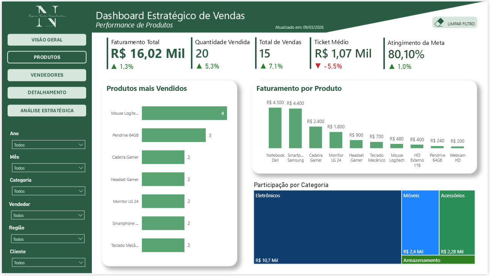
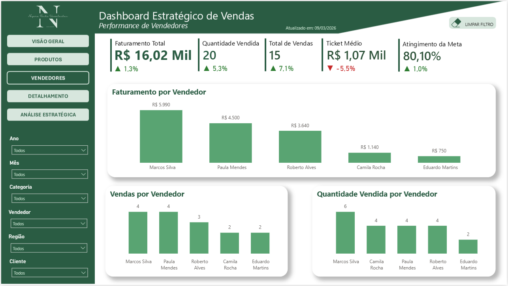
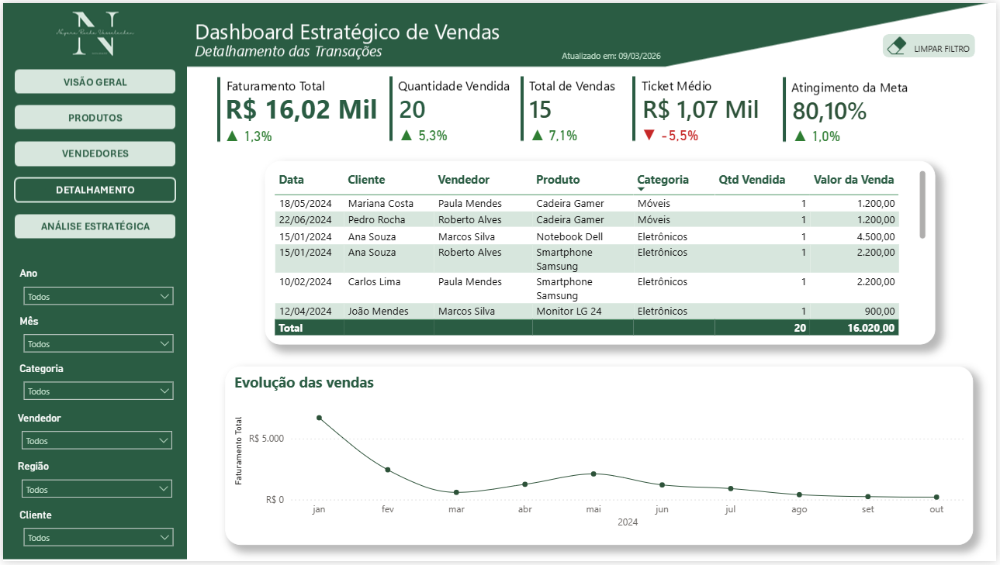
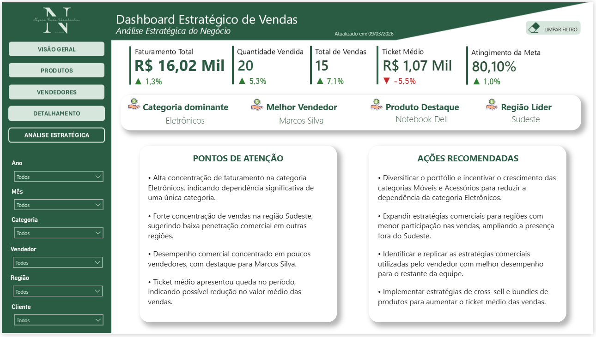

# 📊 Sales Performance Dashboard — Power BI

Projeto de **Business Intelligence** desenvolvido em Power BI com o objetivo de analisar o desempenho comercial de uma empresa fictícia, utilizando métricas de vendas para apoiar a tomada de decisão.

O dashboard permite acompanhar indicadores estratégicos e identificar padrões de vendas, desempenho de vendedores e comportamento de clientes.

---

# 🎯 Problema de Negócio

Empresas precisam acompanhar continuamente sua performance comercial para responder perguntas como:

- Qual é o faturamento total da empresa?
- Quais produtos vendem mais?
- Quais vendedores apresentam melhor desempenho?
- Como as vendas evoluem ao longo do tempo?
- As metas comerciais estão sendo atingidas?

Este dashboard foi criado para responder essas perguntas por meio de **visualizações interativas e métricas de negócio**.

---

# 📈 Principais Métricas

O dashboard apresenta indicadores importantes para análise de performance comercial:

- Faturamento total
- Quantidade vendida
- Ticket médio
- Desempenho de vendedores
- Produtos mais vendidos
- Comparação entre vendas e metas
- Evolução de vendas ao longo do tempo

---

# 🗂 Estrutura do Projeto

```markdown**
powerbi-sales-dashboard
│
├── dashboard_estrategico_de_vendas.pbix
│
├── images
│ ├── 01_pagina_visao_geral_dash_vendas.png
│ ├── 02_pagina_analise_produtos.png
│ ├── 03_pagina_analise_vendedores.png
│ ├── 04_pagina_detalhamento_vendas.png
│ └── 05_pagina_analise_estrategica.png
│
├── design
│ └── dashboard_wireframe_vendas.pptx
│
└── README.md
```

---

# 🧠 Modelagem de Dados

O projeto utiliza **modelagem dimensional (Star Schema)** para facilitar análises e otimizar o desempenho do dashboard.

### Tabela Fato

- vendas

### Tabelas Dimensão

- clientes  
- produtos  
- vendedores  
- datas  

### Tabela de Apoio

- metas de vendas

Essa estrutura permite analisar dados de vendas sob diferentes perspectivas.

---

# 📊 Páginas do Dashboard

## Visão Geral

Apresenta os principais indicadores de desempenho comercial da empresa.


---

## Análise de Produtos

Permite identificar os produtos mais vendidos e mais lucrativos.



---

## Desempenho de Vendedores

Mostra o desempenho individual dos vendedores.



---

## Detalhamento de Vendas

Análise detalhada das vendas por cliente, produto e período.



---

## Análise Estratégica

Página dedicada à análise comparativa entre vendas realizadas e metas comerciais.



---

# 🛠 Tecnologias Utilizadas

- Power BI
- DAX
- Modelagem Dimensional
- SQL
- Git
- GitHub

---

# 📄 Arquivo do Dashboard

<p align="right">

Baixar Dashboar

<a href="https://github.com/nayararv/data-analytics-portfolio/raw/main/projects/powerbi-sales-dashboard/dashboard_estrategico_de_vendas.pbix">

</a>

</p>

---

# 🎯 Objetivo do Projeto

Este projeto foi desenvolvido com o objetivo de demonstrar habilidades em:

- Análise de dados
- Modelagem de dados
- Construção de dashboards
- Visualização de dados
- Interpretação de métricas de negócio

---

# 👩‍💻 Autora

**Nayara Rocha Vasselechen**

Data Analyst | Business Intelligence

